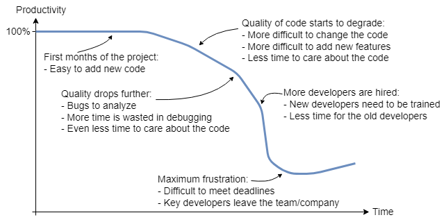

# Software Design: SOLID Principles and Design Patterns in C++

This project includes my study related to the topic of Software Design, particularly the importance of software design for the quality of a project, the SOLID design principles and software design patterns. Design pattern implementation examples are also available in this project using Modern C++.

## Table of contents

- [Motivation](#motivation)
    - [Introduction](#introduction)
    - [Software design](#software-design)
- [Project structure](#project-structure)
- [Requirements](#requirements)
- [Compilation](#compilation)
- [Running](#running)
- [License](#license)
- [References](#references)

## Motivation

### Introduction

Software can be defined as a set of instructions, a program that controls what a computer does, performing operations and specific tasks. Developing software is a process that comprises several stages: software design, programming (coding), testing, release and maintenance.

To develop a computer program and make it work, a high level of knowledge or experience is not necessary. Students who are starting programming studies at schools/universities can easily get a program up and running. The produced code may not be the best or most correct, but it works. Well, everything works perfectly right now, as long as nothing changes and until the moment when new features need to be added.

"**Soft**ware", as the name implies, must be ***soft***, which means that it must be easy to change and extend, and that is the expectation for any software project. That's why it is called *software* in comparison to *hardware*, which is difficult to change. Indeed, one constant in software development is **change**, therefore it is expected that software is easily adapted to the ever-changing requirements. However, in reality, this expectation is often difficult to achieve.

### Software design

High-quality software is software that is easy to **change**, easy to **extend**, and easy to **test**. But, developing high-quality software is hard, very hard. The design of the software should be able to solve the current problem but also general enough to address future problems and requirements. It is also important to avoid redesign, or at least minimize it, but a reusable and flexible design is difficult to get it right the first time. Therefore, it is important to know the answer to the following question:

***What is the core problem of adaptable software and software development in general?***

The answer to that question is: **Dependencies**. Using a sentence stated by Kent Beck:

> "Dependency is the key problem in software development at all scales." (Kent Beck, *Test-Driven Development: By Example*)

This formulation is so true. Indeed, the problem is always about dealing with the connections and relationships between classes and modules. In software, different pieces of code need to work together, and this interaction can create some form of coupling. These artificial dependencies make software harder to change, read, test, and maintain. Thus, the software must be developed in a way that keeps these artificial dependencies at a minimum. But,

***How to break these dependencies?***

The answer is: **Software design**. As Robert C. Martin stated:

> "The goal of software architecture is to minimize the human resources required to build and maintain the required system." (Robert C. Martin, *Clean Architecture*)

Architecture and design are the tools to minimize the dependencies and reduce the complexity via abstractions. Using the words of Klaus Iglberger to define "software design":

> "Software design is the art of managing interdependencies between software components. It aims at minimizing artificial (technical) dependencies and introduces the necessary abstractions and compromises." (Klaus Iglberger, *C++ Software Design*)

Software design is really an art, the art of managing **dependencies** and **abstractions**, trying to minimize dependencies via abstractions and making the software more flexible, easier to change, extend and test.

While the C++ language features and new standards are important, since they provide functionalities that can help us developing better and more readable code, they are not crucial for the success of a software project. Of course, the implementation details matter, but the design and the structure of the code matter even more. It is the structure that is ultimately responsible for the maintenance and scalability of the software project: easier to change, extend, reuse and test the code. To state it in the words of Klaus Iglberger:

> "The design plays a much more central role in the success of a project than any feature could ever do. Good software is not primarily about the proper use of any feature; rather it is about solid architecture and design. Good software design can tolerate some bad implementation decisions, but bad software design cannot be saved by the heroic use of features (old or new) alone." (Klaus Iglberger, *C++ Software Design*)

Software design is essential and can be considered the foundation of the success of a software project, so it matters from the very beginning of the project, and it is a continuous effort. Therefore, every software developer should pay attention to the structure of the code and keep in mind the following:

**Keep the code easy to *change*, easy to *extend*, and easy to *test*.**

Actually, after all, good software is low-cost since it is easy to change and maintain, but bad software is expensive, since more time is required to add new features and can also lead to code refactors which delays the release of those features.

The figure below shows the curve of the productivity over time in a typical software project (source: Klaus Iglberger, *Breaking Dependencies: The Path to High-Quality Software*, Meeting C++ 2022, see [References](#references)).



It is possible to conclude that when the project starts, the productivity of the developers is nearly 100%, but after it drops over time. This is very frustrating for the developers, because everyone is working hard on the project. Despite all their dedication, they can't get the same work done that they were getting before, for the reason that their efforts are now consumed in managing the mess that the software has become, to be able to add one more small new feature to the project. Sometimes, developers think that they can clean up the software later, that it is more important to get to market first. Writing messy code may allow software to be released faster, but it will only slow down developers in the long run, since the code will never be cleaned up later because there is always market pressure. Thus, designing good, clean and well structured software is extremely important, quality of code really matters.

To achieve that, the following question now arises:

***How can we keep the software easy to change, extend and test?***

The answer to the question is: **SOLID principles** and **Design patterns**.

This project addresses both of these topics. See [Project structure](#project-structure) for more details.

## Project structure

This project is structured as follows:

- [SOLID principles](./solid/SOLID_principles.md): description of the SOLID design principles.
- [Design patterns](./designPatterns/DesignPatterns.md): presentation of software design patterns, as well as examples implemented in C++.
- [Unified Modeling Language (UML) basics](./uml/UML_basics.md): brief introduction to the UML language and examples of UML diagrams.

## Requirements

These tools need to be installed on the system for compilation of this project:

- CMake: system to manage the build process.
- C++ compiler: for software compilation (examples: Microsoft Visual C++ (MSVC), GCC and Clang).

## Compilation

The following commands can be utilized to configure the project (example for the Debug build type):

```sh
$ cd <project-directory>
$ mkdir build
$ cd build
$ cmake .. -DCMAKE_BUILD_TYPE=Debug
```

To compile the software, use the CMake build command:

```sh
$ cmake --build . -j 4
```

## Running

After compiling the project, an executable file is created for each design pattern, and can be run using the following command, where `<DesignPatternExe>` corresponds to the executable file name of each design pattern, e.g., `Strategy` (note that some configuration generators (e.g., Visual Studio) might create a folder with the configuration utilized (e.g., Debug) where the binary file will be placed, represented with `[config]` in the command):

```sh
$ cd build
$ ./bin/[config]/<DesignPatternExe>
```

## License

Licensed under the [MIT license](./LICENSE).

## References

- Literature:
    - Klaus Iglberger, *C++ Software Design: Design Principles and Patterns for High-Quality Software*, O'Reilly Media, 1st ed., 2022.
    - Erich Gamma, Richard Helm, Ralph Johnson and John Vlissides, *Design Patterns: Elements of Reusable Object-Oriented Software*, Addison-Wesley Professional, 1st ed., 1994.
    - Dmitri Nesteruk, *Design Patterns in Modern C++20: Reusable Approaches for Object-Oriented Software Design*, Apress, 2nd ed., 2021.
    - Robert C. Martin, *Clean Architecture: A Craftsman's Guide to Software Structure and Design*, Pearson, 1st ed., 2017.
- Conferences (videos):
    - Klaus Iglberger, *[Breaking Dependencies: The Path to High-Quality Software](https://www.youtube.com/watch?v=B4s381OrjWo)*, Meeting C++ 2022.
    - Klaus Iglberger, *[Breaking Dependencies: The SOLID Principles](https://www.youtube.com/watch?v=Ntraj80qN2k)*, CppCon 2020.
    - Klaus Iglberger, *[Back to Basics: Designing Classes (part 1 of 2)](https://www.youtube.com/watch?v=motLOioLJfg)*, CppCon 2021.
    - Klaus Iglberger, *[Back to Basics: Designing Classes (part 2 of 2)](https://www.youtube.com/watch?v=O65lEiYkkbc)*, CppCon 2021.
- Websites:
    - Wikipedia, ["Software"](https://en.wikipedia.org/wiki/Software), Retrieved 2024/10/06.
    - Wikipedia, ["Software design pattern"](https://en.wikipedia.org/wiki/Software_design_pattern), Retrieved 2024/10/06.
    - Wikipedia, ["SOLID"](https://en.wikipedia.org/wiki/SOLID), Retrieved 2024/10/06.
    - Wikipedia, ["Unified Modeling Language"](https://en.wikipedia.org/wiki/Unified_Modeling_Language), Retrieved 2024/10/06.
