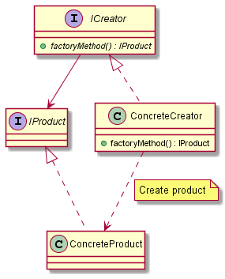

# Factory Method

## Intent

The intent of the Factory Method design pattern is:

- Define an interface for creating a *single* object, but let subclasses decide which class to instantiate. Factory Method lets a class defer instantiation to subclasses.

The Factory Method pattern uses factory methods to deal with the problem of creating objects without having to specify the exact class of the object that will be created. The object is created by calling a factory method rather than by calling a constructor, from the client code.

See the [Abstract Factory](../AbstractFactory/AbstractFactory.md) pattern to verify the key differences between the Factory Method and the Abstract Factory.

## UML diagram

UML representation of the Factory Method design pattern:

## Pros and Cons

Pros of the Factory Method design pattern:

- **Encapsulation**: the object creation logic is encapsulated in a separate method, making it easier to manage and maintain.
- **Flexibility and extensibility**: subclasses can alter the type of objects that will be created, without modifying the client code, because the client does not need to specify the exact class of the object that will be created. With this, new product classes can be introduced easily without changing the existing code.
- **Code reusability**: the common code used for object creation is centralized in the factory method.
- **Polymorphism**: a factory method can be polymorphic, allowing it to return a base class/interface object or a pointer to it.

Cons of the Factory Method design pattern:

- **Complexity**: the number of classes in a design can increase with the introduction of the Factory Method pattern, which might increase its complexity.
- **Abstraction overhead**: the introduction of an additional level of abstraction might be unnecessary for simpler scenarios.

## Code example

A code example of the Factory Method design pattern is available [here](./src/main.cpp).
