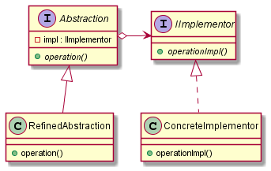

# Bridge

## Intent

The intent of the Bridge design pattern is:

- Decouple an abstraction from its implementation allowing the two to vary independently.

The Bridge design pattern helps minimizing physical dependencies by encapsulating the implementation details behind an abstraction, extracting and isolating these dependencies. It is useful when both the class and its implementation vary often.

The following are the key components contained in the Bridge design pattern:

- **Abstraction**: interface that the client interacts with. It maintains the Implementor reference and typically contains higher-level operations that delegate to the implementation.
- **Refined Abstraction**: variant of the abstraction that provides additional functionality by building on top of the basic abstraction.
- **Implementor**: interface for concrete implementations. It defines the operations that concrete implementations must support.
- **Concrete Implementor**: concrete implementation of the implementor interface.

The Bridge pattern can be applied in different ways:

- **Using polymorphism**: this way uses a base class (abstraction) and has the previously mentioned key components (full bridge). It utilizes a pointer data member (pointer-to-implementation) that is an opaque pointer that represents a bridge to the encapsulated implementation details.
- **Using the Pimpl idiom**: although this ways also uses a pointer-to-implementation, it applies a nonpolymorphic form of Bridge, coming with all the decoupling benefits of the full bridge, however, despite its simplicity, it may result in a more complex implementation of the class.

## UML diagram

UML representation of the Bridge design pattern:

## Pros and Cons

Pros of the Bridge design pattern:

- **Reduction of physical dependencies**: decouples abstraction from implementation, allowing them to vary independently, contributing also for separation of concerns.
- **Easy to change**: simplifies the addition of new abstractions and implementations.
- **No compilation impact on clients**: changes in the implementation of an abstraction have no impact on clients.

Cons of the Bridge design pattern:

- **Overhead with additional indirection**: the pimpl pointer introduces a performance penalty. However, implementing a partial bridge may have a very positive impact effect on performance (it depends on the use case).
- **Complexity**: it can introduce complexity, especially for simpler scenarios, resulting in additional classes and interfaces.

## Code example

A code example of the Bridge design pattern is available [here](./src/main.cpp).
