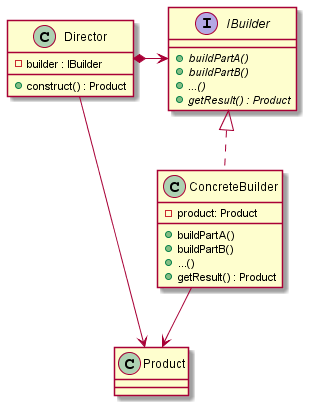

# Builder

## Intent

The intent of the Builder design pattern is:

- Separate the construction of a complex object from its representation, allowing the same construction process to create different representations.

The Builder pattern is useful when an object needs to be constructed with different configurations, and the construction process is complex or involves many steps, being often used in the building of objects composed of other objects.

## Pros and Cons

Pros of the Builder design pattern:

- **Encapsulation of construction process**: the details of the object construction are encapsulated within the builder class, so the client code doesn't need to be aware of the intricate details of the construction process.
- **Code reusability**: the same construction process (builder) can be reused to create various representations of the object.
- **Step-by-Step construction**: allows for a step-by-step construction process, which is particularly beneficial when dealing with complex objects that require specific configurations.

Cons of the Builder design pattern:

- **Increased complexity**: the implementation of the Builder pattern often introduces additional classes or function objects, which can increase the complexity of the codebase and make the code harder to understand.
- **Limited use for simple objects**: for simple objects that don't require a complex construction process, direct construction or other creational patterns may be more appropriate.

## UML diagram

UML representation of the Builder design pattern:

## Code example

A code example of the Builder design pattern is available [here](./src/main.cpp).
