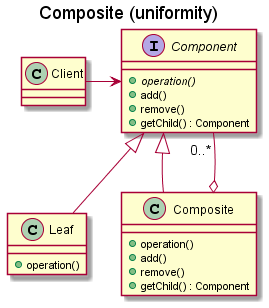

# Composite

## Intent

The intent of the Composite design pattern is:

- Compose objects into tree structures to represent part-whole hierarchies. Composite lets clients treat individual objects and compositions of objects uniformly.

The Composite design pattern allows manipulating a single instance of an object just as manipulating a group of them. A composite can be considered an object designed as a composition of multiple similar objects, all with similar functionality. This design pattern should be used when we want to represent part-whole hierarchies of objects, and when clients may ignore the difference between compositions of objects and individual objects.

The following are the key components contained in the Composite design pattern:

- **Component**: defines the interface for the objects in the composition.
- **Leaf**: implements the Component interface, and represents leaf objects in the composition.
- **Composite**: implements the Component interface, and represents a composite component (having children).

## UML diagram

UML representation of the Composite design pattern:

The Composite design pattern has two design variants for defining child-related operations:

- *Design for uniformity*: child-related operations are defined in the Component interface. This allows clients to treat Leaf and Composite objects uniformly, however child-related operations can be performed on Leaf objects.
- *Design for type safety*: child-related operations are defined only in the Composite class. In this case, clients treat Leaf and Composite objects differently, since child-related operations cannot be performed on Leaf objects.

## Pros and Cons

Pros of the Composite design pattern:

- **Flexibility**: new component types can be added without changing the existing code, adhering to the Open-Closed Principle, and allows easy extension of components within the composite structure.
- **Simplicity in client code**: clients can treat individual objects and composites uniformly, simplifying the client code.
- **Recursive composition**: the Composite pattern makes it easy to create recursive structures like trees and lists, where objects can be composed of other objects of the same type.
- **Encapsulation of hierarchies**: encapsulates the hierarchy and hides its complexity from the client, making the system easier to manage and extend.

Cons of the Composite design pattern:

- **Overhead**: it can introduce additional complexity and overhead if not used carefully, especially in simple scenarios where a composite structure might be overkill. Traversal and management of the composite structure might incur performance costs.
- **Potential for excessive generality**: since all objects need to implement a common interface, it may result in the creation of methods that are not relevant to all classes.

## Code example

A code example of the Composite design pattern is available [here](./src/main.cpp).
