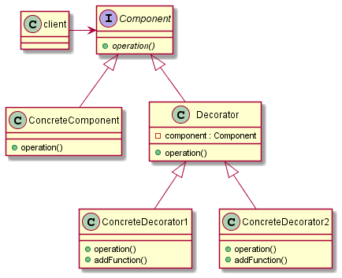

# Decorator

## Intent

The intent of the Decorator design pattern is:

- Attach additional responsibilities to an object dynamically keeping the same interface. Decorators provide a flexible alternative to subclassing for extending functionality.

The Decorator design pattern can be used to extend (decorate) the functionality of individual objects, statically (at compile-time) or dynamically (at run-time), independently of other instances of the same class. Multiple decorators can be stacked on top of each other, each time adding a new functionality to the overridden method(s).

The Decorator is an alternative to subclassing: subclassing adds behavior at compile time, and the change affects all instances of the original class, while decorating can provide new behavior at run-time for selected objects.

## UML diagram

UML representation of the Decorator design pattern:

## Pros and Cons

Pros of the Decorator design pattern:

- **Flexibility**: provides a flexible way to extend object functionality. Instead of creating a complex inheritance hierarchy, decorators can be composed and combined in various ways to extend behaviors.
- **Adhere to the Single Responsibility Principle**: each decorator class focuses on a specific aspect of behavior, promoting the Single Responsibility principle.
- **Adhere to the Open-Closed Principle**: along with the separation of concerns, this pattern also eases the addition of functionality to a class without being modified, promoting the Open-Closed Principle.
- **Combining behaviors**: multiple behaviors can be combined in different ways, offering a high degree of reusability and configuration.
- **Encapsulation**: decorators can encapsulate additional responsibilities, keeping the core functionality of classes uncluttered.

Cons of the Decorator design pattern:

- **Complexity**: the use of many small decorator classes can make the system more complex to understand and maintain.
- **Overhead**: each decorator adds a layer of wrapping, which can lead to higher overhead in terms of memory and performance.
- **Debugging difficulty**: with multiple decorators, tracking the flow of data and debugging can become more difficult.
- **Configuration management**: managing the order of decorators can be challenging, as the order in which they are applied can affect the overall behavior.

## Code example

A code example of the Decorator design pattern is available [here](./src/main.cpp).
