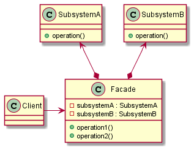

# Facade

## Intent

The intent of the Facade design pattern is:

- Provide a unified interface to a set of interfaces in a subsystem. Facade defines a higher-level interface that makes the subsystem easier to use.

The Facade (sometimes also spelled as "Façade") design pattern uses an object to make a complex subsystem easier to use, hiding the complexities of that larger subsystem and providing a simpler interface (often a simplified one) to the client. A client that accesses a complex subsystem directly can depend on many different objects having different interfaces (tight coupling), which makes it hard to implement, change, test and reuse. Using a Facade object also helps to minimize the dependencies on a subsystem.

## UML diagram

UML representation of the Facade design pattern:

## Pros and Cons

Pros of the Facade design pattern:

- **Simplified usage**: a Facade hides the complexities of a subsystem, making it easier for clients to use.
- **Reduction of dependencies**: clients interact with a simplified interface rather than the complex subsystem, reducing coupling.
- **Readability and maintenance**: code becomes more readable and easier to maintain, since the complex subsystem logic is encapsulated within the Facade.
- **Loose coupling**: changes to the subsystem do not affect the client code as long as the Facade interface remains unchanged.
- **Centralized control**: the Facade can act as a single point of entry to the subsystem, simplifying debugging and control flow.

Cons of the Facade design pattern:

- **Facade can easily acquire too many responsibilities**: if not designed carefully, the Facade can become too large, managing too many responsibilities.
- **Limited flexibility**: it can restrict the functionality of the subsystem if it does not expose enough features through the simplified interface. Over-simplifying the subsystem can hide important functionality or performance bottlenecks.
- **Additional layer of abstraction**: a Facade adds another layer of abstraction, which might not be necessary for simple systems, potentially leading to unnecessary complexity.

## Code example

A code example of the Facade design pattern is available [here](./src/main.cpp).
