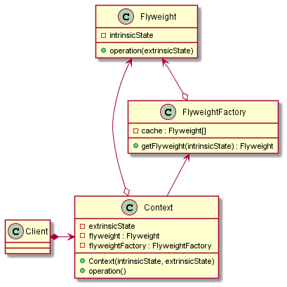

# Flyweight

## Intent

The intent of the Flyweight design pattern is:

- Use sharing to support large numbers of similar objects efficiently.

The Flyweight design pattern allows to minimize memory usage and to improve performance by sharing as much data as possible with similar objects. This pattern is particularly useful when a large number of objects are required, but the cost of creating and maintaining them is prohibitive.

Flyweight objects can have:
- "Intrinsic state": state that is invariant, context-independent and shareable. This state is stored in the Flyweight object.
- "Extrinsic state": state that is variant, context-dependent and can't be shared (unique for each object). The Flyweight object provides an interface for passing this state.

Flyweight objects can be reused by clients, which can pass in extrinsic state as necessary, reducing the number of physically created objects.

A classic example that can use the Flyweight pattern is in a text editor: individual characters can be represented as flyweights, where each character has intrinsic properties like font, size, and style, which can be shared among multiple occurrences, and only the position (extrinsic property) of each character needs to be stored internally.

## UML diagram

UML representation of the Flyweight design pattern:

## Pros and Cons

Pros of the Flyweight design pattern:

- **Decoupling and Flexibility**: the Flyweight pattern can help in decoupling the intrinsic (shared) state from the extrinsic (unshared) state, leading to more flexible and maintainable code.
- **Reduced memory usage**: by sharing common data among multiple objects, the Flyweight pattern significantly reduces memory consumption.
- **Performance improvement**: reducing the number of objects in memory can lead to performance improvements, particularly in terms of speed and resource management.

Cons of the Flyweight design pattern:

- **Complexity**: the Flyweight pattern introduces complexity into the codebase, as it requires managing the shared state and ensuring proper access to the intrinsic and extrinsic states.
- **Overhead of management**: managing the flyweights and ensuring they are used correctly can add overhead to the application.
- **Not always applicable**: the Flyweight pattern is not suitable for all situations, especially if the objects do not have a significant amount of shared data.

## Code example

A code example of the Flyweight design pattern is available [here](./src/main.cpp).
