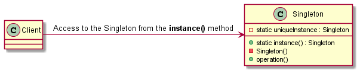

# Singleton

## Intent

The intent of the Singleton design pattern is:

- Ensure a class has only one instance, and provide a global point of access to it.

The Singleton pattern is used when we want to guarantee that there is only one instance of a particular entity, which means that this entity cannot be instantiated multiple times since it represents something that exists only once. Use cases of this might be a logger, a system-wide database or a system clock.

Although the Singleton pattern is considered as a design pattern, it doesn't introduce an abstraction and isn't concerned with the reduction of the dependencies between the different entities in the software. Therefore, Singleton can be considered more of an implementation pattern than a design pattern.

## UML diagram

UML representation of the Singleton design pattern:

## Pros and Cons

Pros of the Singleton design pattern:

- **Unique instance**: ensures that there is only one instance of an object, providing a global point of access to it and allowing access from anywhere in the codebase.
- **Lazy initialization**: the instance of an object is created only when it's requested for the first time, saving memory until it's needed.
- **Resource management**: useful for managing resources that should be shared across the software (e.g., database).

Cons of the Singleton design pattern:

- **Global state**: introduces global state which can make it difficult to track dependencies and debug code.
- **Testing complexity**: the unit testing becomes more difficult, as Singletons can introduce hidden dependencies.
- **Tight coupling**: can lead to tight coupling between classes, making the code less flexible (harder to change) and harder to maintain.

## Code example

A code example of the Singleton design pattern is available [here](./src/main.cpp).
