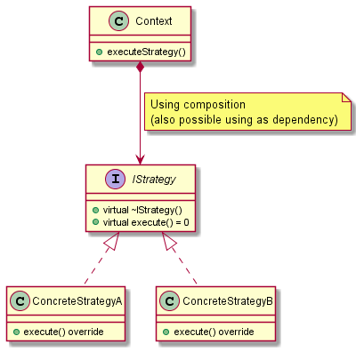

# Strategy

## Intent

The intent of the Strategy design pattern is:

- Define a family of algorithms, encapsulate each one, and make them interchangeable. Strategy allows the algorithm to vary independently from the clients that use it.

## Pros and Cons

Pros of the Strategy design pattern:

- **Code flexibility**: allows to use different algorithms or strategies without modifying the client code, enabling the system to be easily extended.
- **Encapsulation of algorithms**: each strategy is encapsulated within its own class or function object, providing a clear separation between the algorithmic behavior and the client code. This promotes a better code organization and maintainability, allowing also to reduce the dependencies on a particular implementation detail by introducing an abstraction for that detail.
- **Code reusability**: with the encapsulation of the algorithms, strategies can be reused in different contexts or shared across multiple clients. This promotes code reuse and avoids code duplication (DRY principle - Don't Repeat Yourself).
- **Adherence to the Open-Closed Principle**: this pattern adheres to the OCP, because new strategies can be added without modifying existing code, allowing the system to be easily extended.
- **Testability**: strategies can be individually tested in isolation, as they are encapsulated. This helps in unit testing, focusing on testing the behavior of each strategy independently.

Cons of the Strategy design pattern:

- **Increased complexity**: the implementation of Strategy pattern introduces additional classes or function objects, which can increase the complexity of the codebase and make the code harder to understand.
- **Indirection and overhead**: a strategy can introduce an extra layer of indirection between the client and the algorithm, affecting the system performance, since there is an additional function call or object lookup involved.
- **Increased memory usage**: the Strategy pattern may require storing strategy objects in memory, which can increase memory usage compared to inline algorithmic implementations.
- **Single strategy for each algorithm**: a strategy should deal with either a single algorithm or a small group of cohesive functions, to respect the Single-Responsibility principle. If multiple operations need to be extracted, multiple strategies need to be implemented.
- **Potential overengineering**: the Strategy pattern can lead to an overly complex design if not used judiciously. It's important to apply the pattern only when necessary and when there is a clear need for interchangeable algorithms, keeping things as simple as possible (KISS principle - Keep It Simple, Stupid).

## UML diagram

UML representation of the Strategy design pattern:

## Code example

The Strategy can be applied in different ways:

- **Dynamic Strategy**: the strategy can be changed dynamically at runtime.
- **Static Strategy**: the strategy is defined at compile time, as a template parameter, and cannot be changed at runtime.

A code example of the Strategy design pattern is available [here](./src/strategy/main.cpp).
