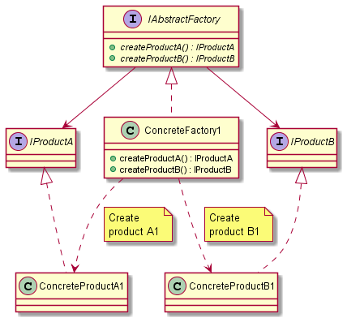

# Abstract Factory

## Intent

The intent of the Abstract Factory design pattern is:

- Provide an interface for creating *families* of related or dependent objects without specifying their concrete classes.

The Abstract Factory and Factory Method design patterns are both creational patterns, but they serve different purposes and have distinct characteristics. The following are the key differences between these patterns:

| Topic | Abstract Factory | Factory Method |
| :---: | --- | --- |
| Structure | Multiple abstract product interfaces, multiple concrete product implementations, an abstract factory interface, and multiple concrete factory implementations. | Single abstract product interface, multiple concrete product implementations, an abstract creator class, and multiple concrete creator implementations. |
| Products | Families of related or dependent products, ensuring that the created objects are compatible with each other, as they belong to the same family. | Primarily deals with a single product, usually standalone, and there is no inherent requirement that the created products must be compatible or belong to a family. |
| Usage | Suitable when there are multiple families of related or dependent products, and the system needs to be configured to use one family at a time. | Suitable when a class cannot anticipate the class of objects it is required to create, or when a class wants its subclasses to specify the objects it creates. |

## UML diagram

UML representation of the Abstract Factory design pattern:

## Pros and Cons

Pros of the Abstract Factory design pattern:

- **Encapsulation**: the creation of related objects is encapsulated, providing a clear and consistent interface to create families of products.
- **Flexibility and extensibility**: allows to swap entire families of products without changing the client code, promoting flexibility and making it easier to introduce new product variants.
- **Consistency across products**: the created objects are compatible with each other, as they belong to the same family, ensuring consistency.

Cons of the Abstract Factory design pattern:

- **Complexity**: the pattern can introduce a level of complexity, especially when dealing with a large number of product types and variations.
- **Maintenance overhead**: adding new product variants or families may require modifying the existing abstract factory interface and all of its implementations, which can result in maintenance overhead.

## Code example

A code example of the Abstract Factory design pattern is available [here](./src/main.cpp).
