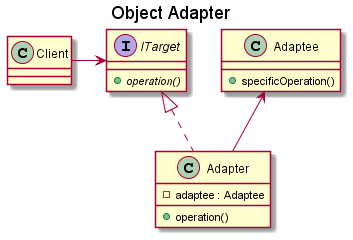
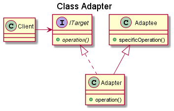

# Adapter

## Intent

The intent of the Adapter design pattern is:

- Convert the interface of a class into another interface clients expect. An adapter lets classes work together that couldn't otherwise because of incompatible interfaces.

The Adapter design pattern, also known as Wrapper, allows incompatible interfaces to work together. It acts as a bridge between two incompatible interfaces by converting the interface of one class into another interface that a client expects. This pattern is useful when we have legacy code or third-party libraries with interfaces that do not match the ones we need to work with.

The Adapter pattern usually involves the definition of a separate `Adapter` class, that converts the incompatible interface of a class (`Adaptee`) into another interface (`Target`) clients require. The idea is to work through the `Adapter` that adapts the interface of an (already existing) class without changing it, and the clients don't know whether they work with a `Target` class directly or through an `Adapter` with a class that does not have the `Target` interface.

Adapter can be applied in different ways:

- Object Adapter: stores an instance of the wrapped (adapted) type, using object composition.
- Class Adapter: inherits from the wrapped type, using multiple inheritance.
- Function Adapter: uses functions to adapt an interface. For example, the free `begin()` and `end()` functions available in the Standard Library have the purpose of adapting the iterator interface of any type to the expected STL iterator interface.

## UML diagram

UML representation of the Adapter design pattern:

## Pros and Cons

Pros of the Adapter design pattern:

- **Reuse of existing code**: adapters enable the integration of legacy or third-party code into new systems without significant modifications.
- **Flexibility**: the usage of an adapter makes incompatible things fit together by adapting interfaces, which allows combining different functionalities and making them work together. This also provides flexibility in the system's design.
- **Encapsulation of system complexities**: adapters encapsulate the complexities of converting interfaces, making the client code simpler.

Cons of the Adapter design pattern:

- **Easy to disrespect the LSP**: adapter makes it very easy to combine things that do not belong together, so it is important to consider the expected behavior and to check for LSP expectations when applying an adapter.
- **Overhead**: the usage of adapter may introduce overhead in terms of performance and memory consumption, although this is typically negligible.
- **Maintenance**: as the system evolves, maintaining adapters to keep them synchronized with the evolving interfaces can be a challenge.

## Code example

A code example of the Adapter design pattern is available [here](./src/main.cpp).
