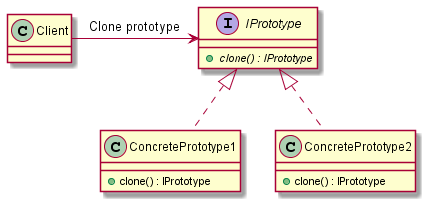

# Prototype

## Intent

The intent of the Prototype design pattern is:

- Specify the kind of objects to create using a prototypical instance, and create new objects by copying this prototype.

The Prototype pattern is used to create new objects based on existing objects through cloning. It is implemented by creating a prototype interface or base class that defines a method for cloning itself (commonly named as `clone`), and derived classes provide the actual cloning functionality.

## UML diagram

UML representation of the Prototype design pattern:

## Pros and Cons

Pros of the Prototype design pattern:

- **Ability to perform abstract copy operation**: the prototype patterns provides an abstract way of creating copies of some abstract entity, which avoids copying only the part relative to the base class from the derived class (*slicing*).
- **Flexibility**: new objects can be created by copying existing ones, providing flexibility in object creation.
- **Reduced subclassing**: reduces the need for subclassing to create new objects, as the new objects can be created by cloning existing ones.
- **Simplified object creation**: simplifies the object creation process by hiding the complexities of creating new objects.

Cons of the Prototype design pattern:

- **Performance**: the performance has a negative impact with the indirection due to pointers. The prototype pattern is implemented, very often, by dynamic memory, and the allocation and the possible resulting fragmented memory affect the performance.
- **Complexity**: if the object being cloned has complex dependencies or requires deep copying, implementing the clone method can be complex.
- **Dynamic typing overhead**: depending on the implementation, dynamic typing overhead might be introduced if the prototype needs to be cast to a specific type after cloning.

## Code example

A code example of the Prototype design pattern is available [here](./src/main.cpp).
