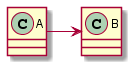
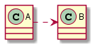
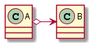
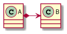
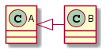
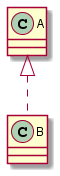
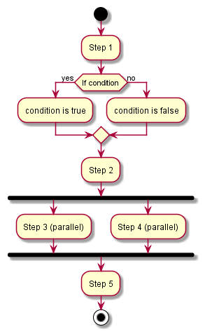
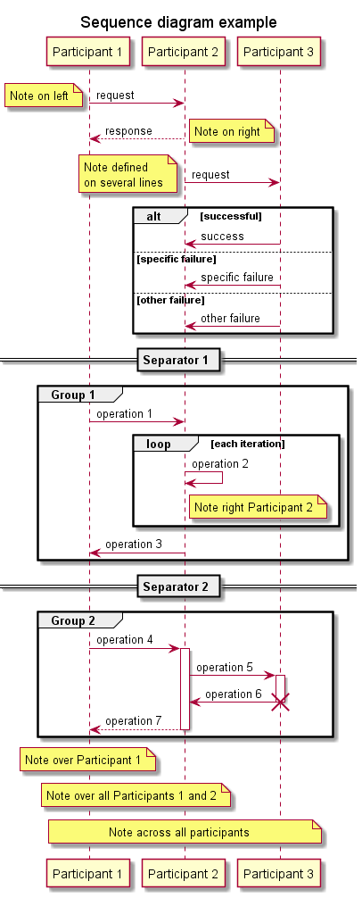

# Unified Modeling Language basics

## Table of contents

- [Introduction](#introduction)
- [Structure diagrams](#structure-diagrams)
    - [Class diagram](#class-diagram)
- [Behavior diagrams](#behavior-diagrams)
    - [Activity diagram](#activity-diagram)
    - [Sequence diagram](#sequence-diagram)
- [Tools](#tools)

## Introduction

The [Unified Modeling Language](https://en.wikipedia.org/wiki/Unified_Modeling_Language) (UML) is a general-purpose, developmental modeling language in the field of software engineering that is intended to provide a standard way to visualize the design of a system.

UML offers the following to visualize a system architecture:

- Activities (jobs).
- Individual components of the system, and how they can interact with other software components.
- How the system will run.
- How entities interact with others (components and interfaces).
- External user interface.

UML diagrams are divided into 2 categories:

- Structure diagrams.
- Behavior diagrams.

## Structure diagrams

The structure diagrams:

- Represent the static aspects of the system.
- Emphasize the things that must be present in the system being modeled.
- Are used extensively in documenting the software architecture of software systems.

This type of diagrams includes:

- Class diagram.
- Component diagram.
- Composite structure diagram.
- Deployment diagram.
- Object diagram.
- Package diagram.
- Profile diagram.

In this documentation, only the class diagram is detailed.

### Class diagram

Class diagrams describe the structure of a system by showing the system's classes, their attributes, operations (or methods), and the relationships among objects.

#### Members

To specify the visibility of a class member (i.e. any attribute or method), these notations must be placed before the members' name:

| Character | Visibility |
| :---: | :---: |
| `+` | Public |
| `-` | Private |
| `#` | Protected |
| `~` | Package |

#### Class relationships

A relationship is a general term covering the specific types of logical connections found on class and object diagrams. UML defines the following relationships:

- Association (*knows*): one element knows the other.
- Dependency (*uses*): it exists between two elements if changes to the definition of one element (the server or target) may cause changes to the other (the client or source).
- Aggregation (*has*): represents a part-whole or part-of relationship. When the container is destroyed, the contents are not usually destroyed (e.g., *shared pointer* to a container in a class).
- Composition (*has*): stronger form of aggregation. When the container is destroyed, the contents are also destroyed (e.g., *unique pointer* to a container in a class).
- Inheritance (*extends*): a class is derived from another class.
- Realization (*implements*): a class implements an interface.

Notation for a class diagram example of **association**:



Notation for a class diagram example of **dependency**:



Notation for a class diagram example of **aggregation**:



Notation for a class diagram example of **composition**:



Notation for a class diagram example of **inheritance**:



Notation for a class diagram example of **realization**:



UML allows the specification of the multiplicity in a relation (the range of number of objects that participate), as follows:

| Multiplicity | Description |
| :---: | :---: |
| 0 | No instances |
| 0..1 | No instances, or one instance |
| 1 | Exactly one instance |
| 1..1 | Exactly one instance |
| 0..* | Zero or more instances |
| 1..* | One or more instances |

## Behavior diagrams

The behavior diagrams:

- Represent the dynamic aspect of the system.
- Emphasize what must happen in the system being modeled.
- Are used extensively to describe the functionality of software systems.

This type of diagrams includes:

- Activity diagram.
- Communication diagram.
- Interaction overview diagram.
- Sequence diagram.
- State diagram.
- Timing diagram.
- Use case diagram.

In this documentation, only the activity and the sequence diagrams are detailed.

### Activity diagram

Activity diagrams are graphical representations of workflows of stepwise activities and actions with support for choice, iteration and concurrency. These diagrams can be regarded as a form of a structured flowchart combined with a traditional data flow diagram.

An activity diagram example:



### Sequence diagram

Sequence diagrams show process interactions arranged in time sequence that detail how operations are carried out.

A sequence diagram example:



## Tools

There are many tools that support some functions of UML. PlantUML is one of them, it is an open-source tool allowing users to create diagrams from a plain text language.

This tool can be used from the command line to generate an image from a file, as follows:

```sh
$ java -jar <plantuml.jar> -verbose <file>
# Or
$ plantuml -verbose <file>
```

The diagrams presented in this guide were built using PlantUML (the code is available in the [`assets`](./assets/) directory).
